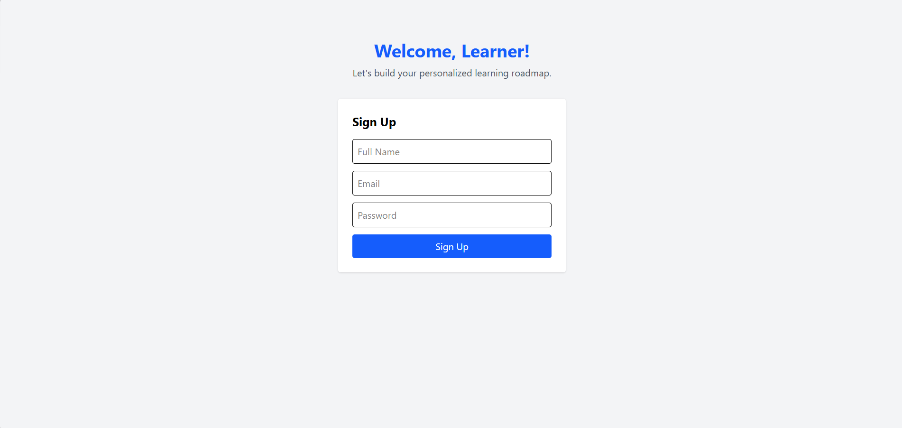
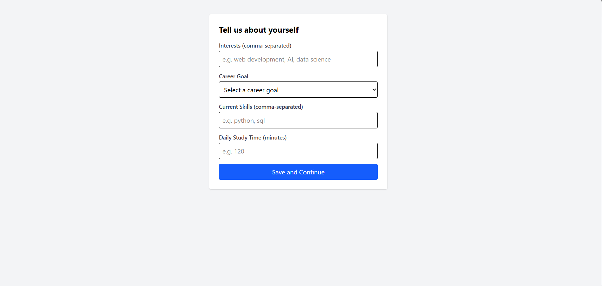
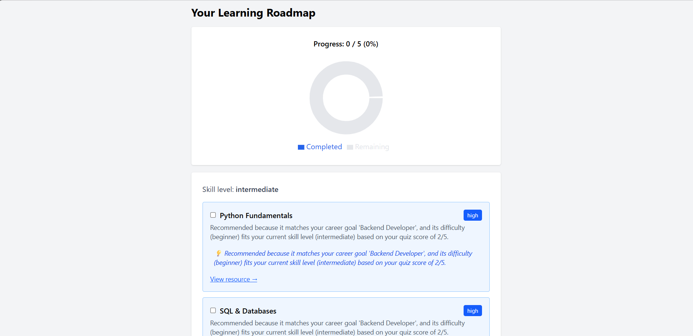

# AI-Powered Personalized Learning Recommendation System

A full-stack web application that helps learners discover what to study next, based on their career goals, current skills, and a short skill assessment — with clear, explainable reasoning behind every recommendation.

**Live demo:** https://ai-learning-recommender.vercel.app
**Backend API docs:**https://ai-learning-recommender-2dgt.onrender.com/docs

> Note: the backend is hosted on a free tier and may take 30-60 seconds to wake up on first load.

## Features

- Secure signup/login with JWT authentication and bcrypt password hashing
- Onboarding flow capturing interests, career goals, current skills, and available study time
- 5-question skill assessment quiz with automatic scoring
- Rule-based recommendation engine that generates a personalized learning roadmap, with a plain-English explanation for every recommendation
- AI-generated (Claude API) friendly explanations for top recommendations, with graceful fallback if the API is unavailable
- Progress tracking with a live-updating donut chart
- Fully deployed: frontend (Vercel), backend (Render), PostgreSQL (Render)

## Tech Stack

**Frontend:** React, Vite, Tailwind CSS, React Router, Recharts, Axios
**Backend:** FastAPI, SQLAlchemy, Pydantic, python-jose (JWT), Passlib (bcrypt)
**Database:** PostgreSQL
**AI:** Anthropic Claude API
**Deployment:** Vercel (frontend), Render (backend + database)

## Architecture
The frontend is a single-page application that communicates with the backend exclusively through a REST API secured by JWT bearer tokens. The recommendation engine is rule-based and fully explainable by design — the AI layer is used narrowly, to rephrase (not generate) the underlying logic's reasoning in friendlier language, with the original rule-based reason always available as a fallback.

## Screenshots

| Signup | Onboarding |
|---|---|
|  |  |

| Quiz | Dashboard |
|---|---|
|  |  |

## Installation (Local Development)

### Prerequisites
- Python 3.10+
- Node.js 18+
- PostgreSQL 14+

### Backend
```bash
cd backend
python -m venv venv
source venv/Scripts/activate  # Windows
pip install -r requirements.txt
# Create a .env file with DATABASE_URL, SECRET_KEY, and ANTHROPIC_API_KEY
uvicorn main:app --reload
```

### Frontend
```bash
cd frontend
npm install
npm run dev
```

### Database
Run `database/schema.sql` against your PostgreSQL instance to create all required tables.

## Known Limitations & Future Improvements

- Recommendation engine uses exact string matching for skills (case-insensitive substring match); fuzzy matching or NLP-based skill extraction would improve accuracy
- Career goals are limited to 3 predefined paths; expanding the topic catalog would support more careers
- Client-side auth check only verifies token *presence*, not validity/expiry; calling `/me` on load would be more robust
- No automated test suite yet; manual testing was performed at each development stage
- Topics are stored in code rather than a database table — a reasonable tradeoff for this project's scope, but a dedicated `topics` table with an admin interface would scale better

## Author

Built by Aastha as a learning project, developed over 20 days with a structured, mentorship-driven approach — every line of code was written and understood individually, not generated wholesale.